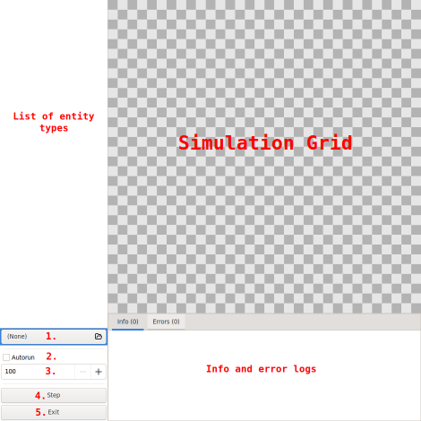
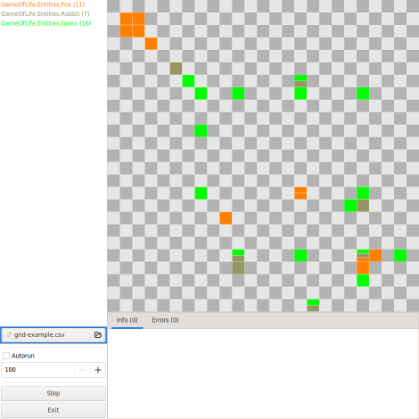
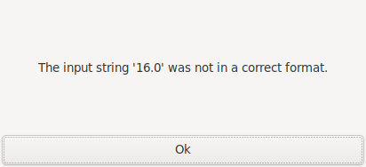
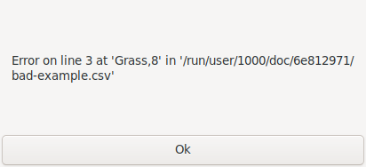
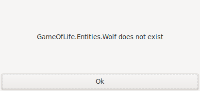

# The Application Window and it's Usage

The window of the application is made with the [Gtk 3.22](https://github.com/GNOME/gtk/tree/gtk-3-22) wrapper, [GtkSharp](https://github.com/GtkSharp/GtkSharp).


## User Interface



1. Open a file dialog to load a csv file with the correct format to set the initial state of the grid. 
2. If Autorun is checked the simulation will step itself with the specified interval.
3. Specifies the interval between automatic steps in milliseconds.
4. Steps the simulation forward by one.
5. Exits the application.

- List of entity types - This will display the type of Sims currently on the grid.
- Simulation Grid - This is where the Sims are displayed. Each cell can hold at maximum 8 Sims at once. If a cell has multiple Sims then they are represented a lines.
- Info and error logs - This can be used by the [GameManager](../GameOfLifeSim/GameManager.cs) and the Sims to log info and errors of the current step.

#### Loaded Grid



## CSV Format

The first line specifies the the size of the grid with the `{width}x{height}` format.\
The following lines specify the Sims that should be placed into the grid with the `{name},{x},{y}` or `{name};{x};{y}` format.\
The names of the Sims are case sensitive and both of their positions start from 0.

### Example

```csv
16x16
Grass,6,6
Grass,7,15
Grass,10,7
Grass,15,2
Rabbit,5,5
Rabbit,10,2
Rabbit,11,2
Rabbit,15,6
Fox,3,3
Fox,9,7
```
> The grid is 0 indexed.

### CSV Loading Errors

There are multiple errors that can occur when the csv is incorrectly formatted.\
In these cases a popup window will appear with an error message such as these:

#### The first line contains a decimal number.


#### The third line is missing the y position.


#### No Sim named Wolf exists.


> These are just some of the most common errors that can occur.


## Info and Error Messages

These messages serve both an informational and debugging purpose to help make sense what state different Sims are and if they encountered any unexpected errors.\
Both tabs only display the messages from the last step/cycle of the simulation, so if we are getting any errors it the best to disable Autorun and single step the simulation.

### Info Tab

The Sims can display information about themselves here which is useful for debugging their behavior.\
The [GameManager](../GameOfLifeSim/GameManager.cs) also displays failed updates here, but these are not errors, because their failure is caused by the constraints of the [Grid](../GameOfLifeSim/Grid.cs) system such as trying to put a Sim *outside the grid* or *to a cell that is already full*.

### Errors Tab

This tab can also be used by the Sims if they catch any exceptions, but cannot handle them, but it is mainly for the [GameManager](../GameOfLifeSim/GameManager.cs) to report the uncaught exceptions of the Sims.
